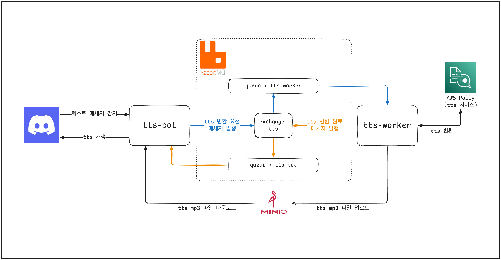

# TTS Discord Bot

Discord 텍스트 채널의 메시지를 음성으로 변환하여 음성 채널에서 재생하는 봇입니다.

## Architecture



### 흐름

1. **tts-bot**: Discord 텍스트 채널에서 메시지 감지
2. **tts-bot** → **RabbitMQ**: TTS 변환 요청 메시지 발행 (`tts.worker` 큐)
3. **tts-worker**: 큐에서 메시지 소비
4. **tts-worker** → **AWS Polly**: 텍스트를 음성으로 변환
5. **tts-worker** → **MinIO**: 변환된 MP3 파일 업로드
6. **tts-worker** → **RabbitMQ**: 변환 완료 메시지 발행 (`tts.bot` 큐)
7. **tts-bot**: 큐에서 완료 메시지 소비
8. **tts-bot** → **MinIO**: MP3 파일 다운로드
9. **tts-bot** → **Discord**: 음성 채널에서 재생

## 프로젝트 구조

```
tts-discord-bot/
├── packages/
│   ├── rabbitmq/          # RabbitMQ 클라이언트 패키지
│   └── minio/             # MinIO(S3) 클라이언트 패키지
├── tts-bot/               # Discord 봇
└── tts-worker/            # TTS 변환 워커
```

## 요구사항

- Python 3.13+
- FFmpeg (음성 재생용)
- RabbitMQ
- MinIO (또는 S3 호환 스토리지)
- AWS 계정 (Polly 사용)

## 설치

```bash
# FFmpeg 설치 (macOS)
brew install ffmpeg

# 의존성 설치
uv sync
```

## 환경변수

`.env` 파일 생성:

```env
# Discord
DISCORD_TOKEN=your-discord-bot-token

# RabbitMQ
RABBITMQ_HOST=localhost
RABBITMQ_PORT=5672
RABBITMQ_USERNAME=guest
RABBITMQ_PASSWORD=guest

# MinIO
MINIO_ENDPOINT_URL=http://localhost:9000
MINIO_ACCESS_KEY=minioadmin
MINIO_SECRET_KEY=minioadmin
MINIO_BUCKET_NAME=tts

# AWS (Polly)
AWS_ACCESS_KEY_ID=your-aws-access-key
AWS_SECRET_ACCESS_KEY=your-aws-secret-key
AWS_REGION_NAME=ap-northeast-2
```

## 실행

```bash
# Worker 실행
uv run python -m tts_worker

# Bot 실행 (별도 터미널)
uv run python -m tts_bot
```

## 사용법

1. Discord 서버에 봇 초대
2. 음성 채널에 입장
3. 텍스트 채널에서 `!join` 명령어로 봇을 음성 채널에 입장시킴
4. 텍스트 채널에 메시지를 입력하면 음성으로 재생됨
5. `!leave` 명령어로 봇을 음성 채널에서 퇴장시킴

## 명령어

| 명령어 | 설명 |
|--------|------|
| `!join` | 봇을 사용자가 있는 음성 채널에 입장 |
| `!leave` | 봇을 음성 채널에서 퇴장 |
